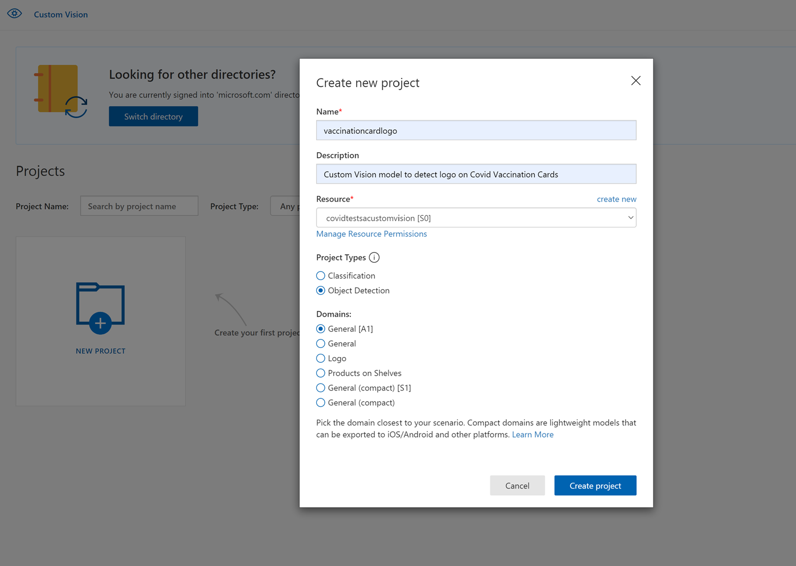
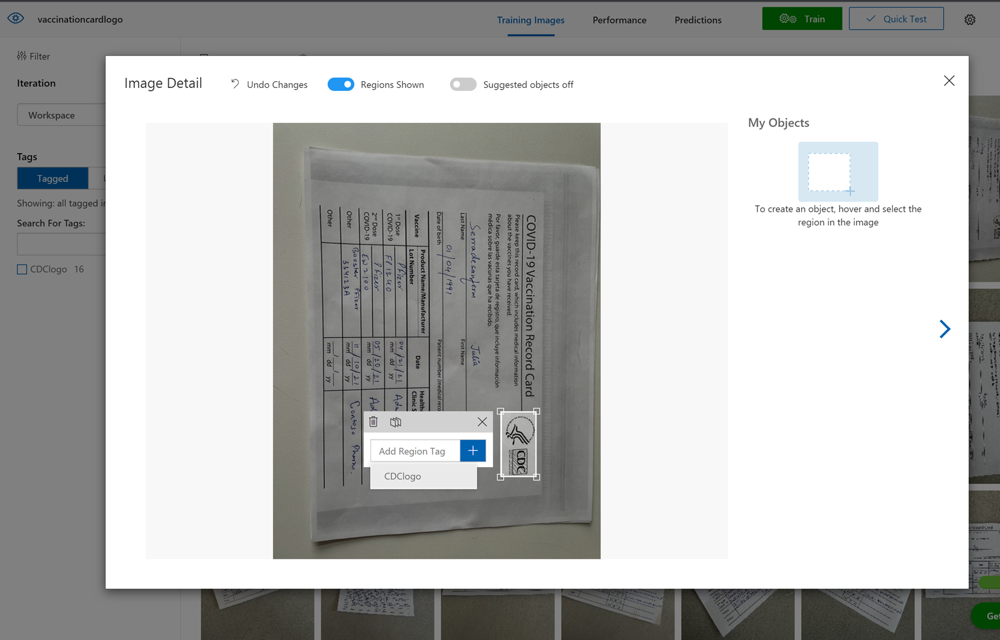
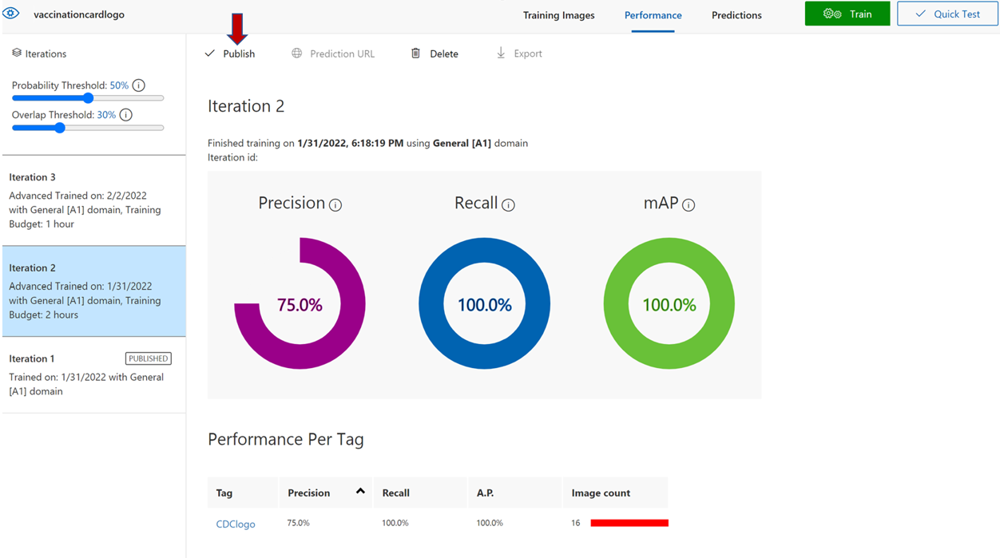

##Step 5: Train a Custom Vision Model

1. Go to [Azure Custom Vision Portal](customvision.ai) and click on "New Project".

2. Input the Project Information as below:
    * Name of Project: "vaccinationcardlogo"
    * Description: "Custom Vision model to detect logo on Covid Vaccination Cards"
    * Resource: Pick the custom vision resource that was created as part of deploying resources.
    * Project Types: Pick "Object Detection"
    * Domain: pick "General[A1]"
    * Click "Create Project"

3. Click "Add Images" and upload the images from the cloned repository [Data/CustomVisionImages](./Data/CustomVisionImages). After Upload, the images will appear as below:

4. Click on the first Picture and draw a bounding box around CDC logo and add tag "CDClogo" like below:

5. Similarly tag all the pictures with CDClogo.
6. Once the tagging is done, Click on Train. Choose "Advance Training" and set up 1 hour to start. Users can extend the time to improve the performance by choosing longer time to train.

7. Once the model training is done, the performance of model will be displayed with Precision and Recall like below. Click on Publish to publish the PredictionAPI.

8. Put Model name: "customvisionvaccinationcard". Choose Prediction Resource as "covidtestsacustomvision-Prediction" which was created as part of deployment process.
9. Once the model is published, the "prediction API" will be generated along with "Prediction URL" like below:

10. The "Prediction URL" and "Prediction API" will be used in calling the custom vision model from Logic App.

Navigate to Step 6 in the the [Deployment Guide](./Deployment.md)