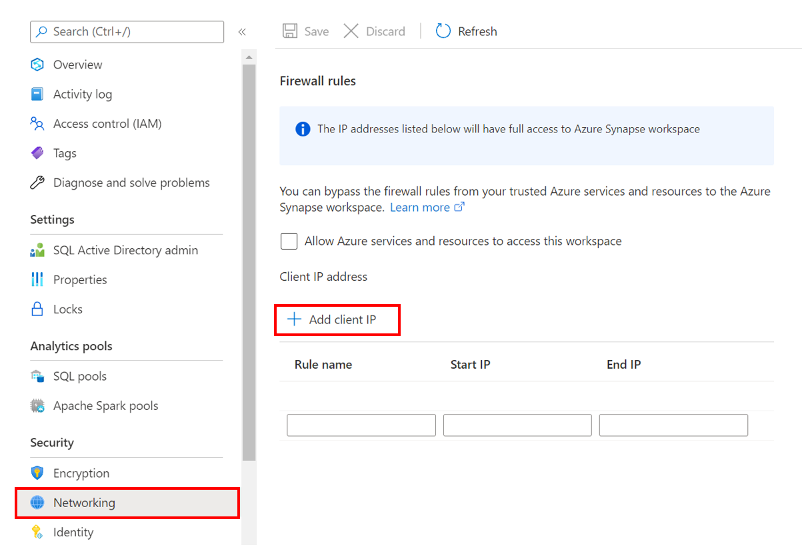
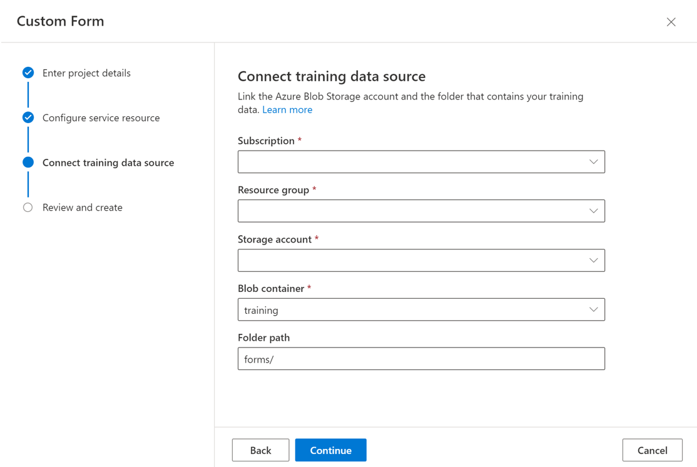
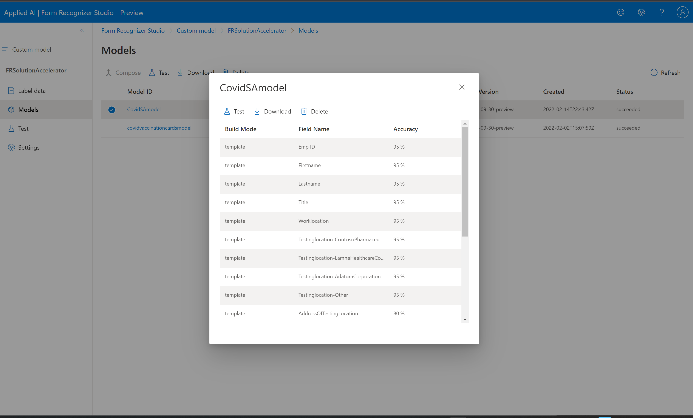
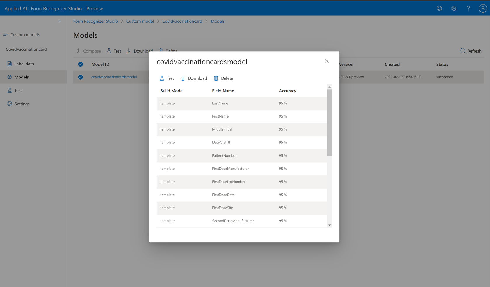
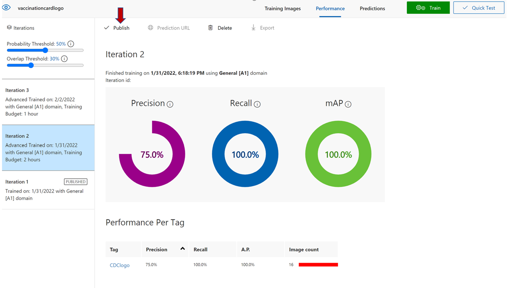
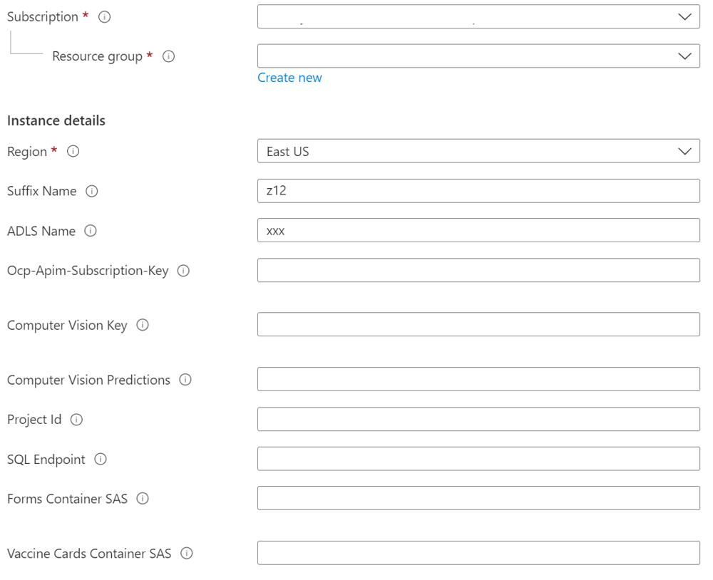
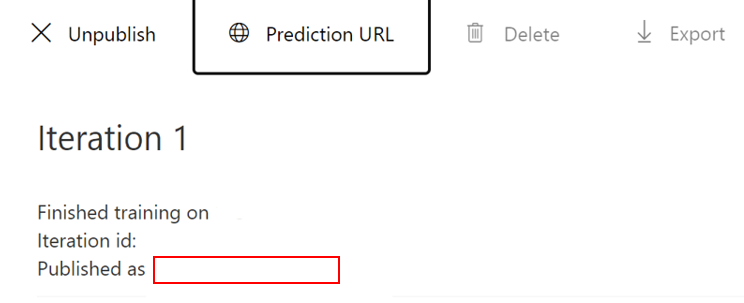
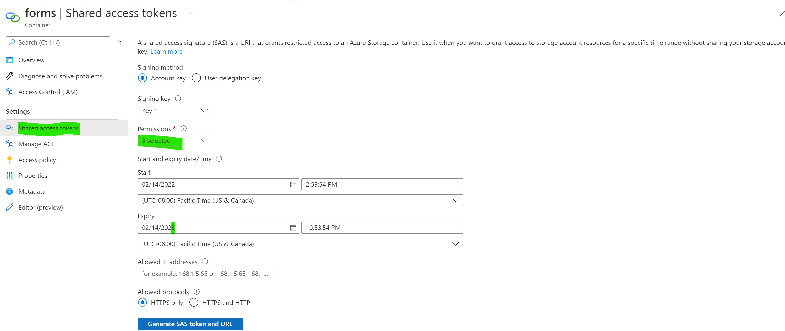
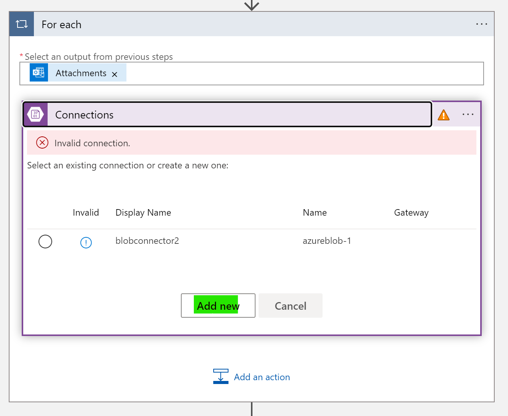
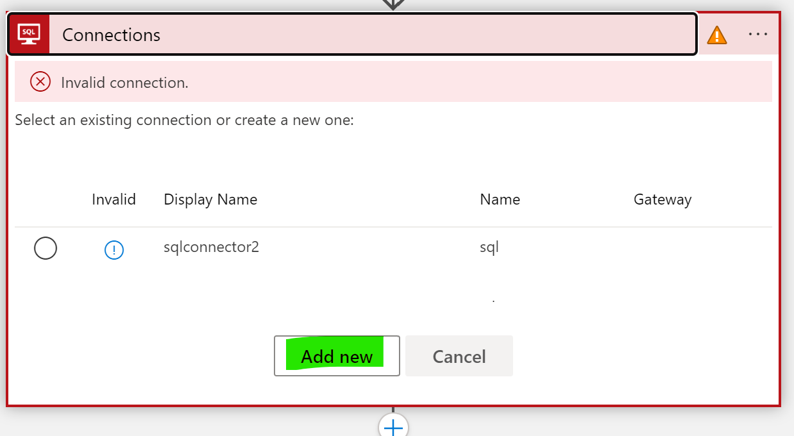

# Deployment Guide 
Please follow the steps below to set up the Azure environment

## Step 1: Download Files
Clone or download this repository and navigate to the project's root directory.

## Step 2: Security Access 
### Step 2.1: Add your IP address to Synapse firewall
Before you can upload assests to the Synapse Workspace you will need to add your IP address:
1. Go to the Synapse resouce you created in the previous step. 
2. Navigate to `Networking` under `Security` on the left hand side of the page.
3. At the top of the screen click `+ Add client IP`
      
4. Your IP address should now be visible in the IP list

### Step 2.2: Update storage account permisions 
In order to perform the necessary actions in Synapse workspace, you will need to grant more access.
1. Go to the Azure Data Lake Storage Account for your Synapse Workspace
2. Go to the `Access Control (IAM) > + Add > Add role assignment` 
3. Now search and select the `Storage Blob Data Contributor` role and click "Next" 
4. Click "+ Select members", search and select your username and click "Select" 
5. Click `Review and assign` at the bottom

[Learn more](https://docs.microsoft.com/azure/synapse-analytics/security/how-to-set-up-access-control)

## Step 3: Setting up Storage Account and Azure Data Lake Storage
The Azure Data Lake Storage (ADLS) is used to receive and store the images (COVID Test attestation forms and Vaccination Cards). The Logic Apps will send images stored in ADLS to the Computer Vision (Forms Recognizer) model to extract fields.

1. Go to the [Azure Portal](portal.azure.com) and select the Storage Account that was created as part of the Synapse deployment 

2. In the menu pane on the left, under `Data storage`, select `Containers`.
  
3. Select the `forms` container and add three directories - `failed`, `raw`, `validated`.

3. Select the training container and add two directories - `forms`, `vaccinecards`

5. Select the results container and add two directories - `failed`, `validated`

## Step 4: Train Form Recognizer models

In this step you will train two custom Form Recognizer models for Covid Test forms and Vaccination Cards 

### Step 4.1: Train model for Covid test forms

1. Go to [Azure Portal](portal.azure.com) and select the Storage Account that was created as part of the deployment.
2. Click on `Containers` on the left menu and click on `Training` container, and `forms` folder. Upload all files from  [Data/FormsRecognizerLabelData/CovidTestForm](./Data/FormsRecognizerLabelData/CovidTestForm) folder. 
3. Go to [Form Recognizer Studio](https://formrecognizer.appliedai.azure.com/studio), select "Custom Form", select "+Create a project" to create a project for labeling. 
4. Enter Project name: "CovidFormsProject" or any other project name of your choice.
5. Enter Description:"Custom form recognizer model with sample Contoso forms" and click "Continue".
6. This step connects the form recognizer studio to form recognizer resource in your subscription. Select your Subscription, Resource Group, Form Recognizer resource which was created as part of deploying the resources and select the latest API Version. Click "Continue"
7. This step connects the form recognizer studio to ADLS storage/container resource in your subscription to access the training data. Select subscription, Resource Group, storage account, container: "Training" and folder "forms"- which was created as part of the deployment. Click "Continue". Review Information and click "Create Project"

 
8. After the project is created, forms with OCR, Key-Value pair labels will appear like below

 
9. Select `Template` for Build Mode and click on "Train" to train the form recognizer model to extract the key-value pairs.

10. Once Training is done, the model will be located in Models with confidence score of each field.

 
11. This is the modelID which will be used in calling the form recognizer model from Logic App.

### Step 4.2 Train model for vaccination cards. 

1. Go to [Azure Portal](portal.azure.com) and select the Storage Account that was created as part of the Synapse deployment.
2. Click on `Containers` on the left menu and click on `training` container, and click on `vaccinationcards` folder. Upload all files from [Data/FormsRecognizerLabelData/VaccinationCardForm](./Data/FormsRecognizerLabelData/VaccinationCardForm) folder.
3. Go to [Form Recognizer Studio](https://formrecognizer.appliedai.azure.com/studio), select "Custom Form", select "+Create a project" and follow below steps to create a project for labeling. 
4. Enter Project name: "FRVaccineSolutionAccelerator" or any specific project name user want to give.
5. Enter Description: "This is a custom form recognizer model trained on sample Contoso forms to mandate employee testing weekly" and click "Continue".
6. This step connects the form recognizer studio to form recognizer resource in your subscription. Select your Subscription, Resource Group, Form Recognizer resource which was created as part of deploying the resources and select the latest API Version. Click "Continue"
7. This step connects the form recognizer studio to ADLS storage/container resource in your subscription to access the training data. Select subscription, Resource Group, storage account, container: "Training" and folder "forms"- which was created as part of the deployment. Click "Continue". Review Information and click "Create Project"
8. After the project is created, forms with OCR, Key-Value pair labels will appear like below

5. Click on "Train" to train the form recognizer model to extract the key-value pairs.
6. Once Training is done, the model will be located in Models with confidence score of each field.

7. This is the modelID which will be used in calling the form recognizer model from Logic App.

<!-- * Go to the [Form Recognizer Model Deployment Guide](./FormsRecognizerModel.md) to train the models. -->

## Step 5: Train a Custom Vision Model
In this step you will train a custom vision model to check the CDC logo on the vaccination card. 

1. Go to [Azure Custom Vision Portal](https://www.customvision.ai/) and click on "New Project".

2. Input the Project Information as below:
    * Name of Project: "vaccinationcardlogo"
    * Description: "Custom Vision model to detect logo on Covid Vaccination Cards"
    * Resource: Pick the custom vision resource that was created as part of deploying resources.
    * Project Types: Pick "Object Detection"
    * Domain: pick "General[A1]"
    * Click "Create Project"

3. Click "Add Images" and upload the images from the cloned repository [Data/CustomVisionImages](./Data/CustomVisionImages). After Upload, the images will appear as below:

4. Click on the first Picture and draw a bounding box around CDC logo and add tag "CDClogo" like below:

5. Similarly tag all the pictures with CDClogo.
6. Once the tagging is done, Click on Train. Choose "Advance Training" and set up 1 hour to start. Users can extend the time to improve the performance by choosing longer time to train.

7. Once the model training is done, the performance of model will be displayed with Precision and Recall like below. Click on Publish to publish the PredictionAPI.

8. Put Model name: "customvisionvaccinationcard". Choose Prediction Resource as "covidtestsacustomvision-Prediction" which was created as part of deployment process.
9. Once the model is published, the "prediction API" will be generated along with "Prediction URL" like below:

10. The "Prediction URL" and "Prediction API" will be used in calling the custom vision model from Logic App.

<!-- * Go to the [Custom Vision Model Deployment Guide](./CustomVisionModel.md) to train the model and publish an interation. -->

## Step 6: Upload Assets and Run SQL Scripts
1. Launch the Synapse workspace [Synapse Workspace](https://ms.web.azuresynapse.net/)
<!-- 2. Go to the `Develop` Hub, click the `+`, and click `Import` to select all notebooks from this repository's [folder](./Code/Notebooks)
3. For each of the notebooks, select `Attach to > spark1` in the top dropdown
4. Configure the parameters in the following notebooks and publish the changes -->
2. In the `Develop` Hub, click the `+`, and click `Import` to select all SQL scripts from this repository's [folder](./Code/SQLScripts)
3. For each SQL script, select `Connect to > sqlpool1` in the top dropdown
4. Select `Run` in the top to create the SQL tables 

## Step 7: Deploy Logic App
In this step you will deploy the reqired resources to process Test forms and/or Vaccination cards sent via email. 

We need to build two different Logic Apps. 
The first logic app we are going to build will help us ingest the Testing forms and process them.
The second logic app we are going to build will help us ingest the Vaccine cards, process them and verify their vailidity.

### **Deploy the Logic Apps**
The button below will deploy Azure Logic App into the resource group you are using for this solution:

The 2 logic apps will be deployed, one ending in "testform" and the other one ending in "vaccinationcard".

### **Configuring the ARM template**
In order for the logic apps to work, we need to configure the following variables. 

Populate the variables accordingly.

1. **Resource group**: Use the `same resource group` where the previous ARM template was deployed.

2. **Region**: This field will be auto-filled.

3. **Suffix Name**: Insert a `suffix name` (e.g. Your initials)

4. **ADLS Name**: The storage account name you are using for this solution.

5. **Ocp-Apim-Subscription-Key**: The `forms recognizer access key`.
    * Navigagte to the Forms Recognizer resource in your resource group
    * Select `Keys and Endpoint` on the left and copy `Key 1`

6. **Computervision Key**: The `PredictionKey` of the custom vision model.
    * Navigate to the Custom Vision Predictions resource in your resource gorup 
    * Select `Keys and Endpoint` on the left and copy `Key 1`

7. **ComputerVisionPredictions**: The `model name` of the custom vision service.
    * Navigate to the [Azure Custom Vision Portal](https://www.customvision.ai/)
    * Select `Perfomance` click on `Iteration 1` 
    * Copy the `Publisheed as` value 

8. **Project Id**: The `ProjectID` of the custom vision model.
    * Navigate to the [Azure Custom Vision Portal](https://www.customvision.ai/)
    * Select the Settings (gear icon) in the top right 
    * Copy the Project Id 

9. **SQLEndpoint**: The `SQL endpoint`
    * Navigate to the Azure Synapse Analytics resource in your resource group
    * Copy the `Dedicated SQL endpoint` value 

10. **FormsContainerSAS**: The SAS token for the `forms` container
For this step, we need to go to the storage account and inside the container generate a SAS
    * Navigate to the  `forms` container in your storage account in your resource group
    * Select the `shared access tokens` on the left
    * Under `permissions` select `Read`, `Access` and `List`
    * Select a reasonable amount of time before it expires. For the above image, we used a year from today (until 2023).

11. **VaccineCardsContainerSAS**: The SAS token for the `vaccinecards` container
    * Follow the previous step 

### **Configuring the Logic App**
Once the Logic Apps are deployed, go to the designer view of either the testform logic app or the vaccination card logic app.

Configure the following 3 connectors:
a. Email connector

b. Storage connector

C. SQL connector

Repeat the same process for the other logic app.

<!-- * Go to the [Logic App Deployment Guide](./LogicAppConfiguration.md) to set up the logic apps. -->

## Step 8: Power BI Set Up 
1. Open the [Power BI report](https://github.com/microsoft/Azure-Solution-Accelerator-to-automate-COVID-19-Vaccination-Proof-and-Test-Verification-Forms/tree/main/Deployment/PowerBI/TestingVaccineDashboard.pbix) in this repository

2. Click the Transform data dropdown and click Data source settings 

3. Select the Azure Synapse Workspace connection, select `Change Source...` and provide your SQL Server Database name under Server and click `OK`
    * Navigate to the Synapse Workspace overview page in the Azure Portal, copy the Dedicated SQL endpoint
4. Select `Edit Permissions`, under Credentials select `Edit`, sign in to your Microsoft Account, click "OK" and click "Close"
5. Select `Refresh`

<!-- ## Step 9: Function App
The Function is used in the Covid Check Power App to select/insert/update forms documents in the Cosmos DB.
Go to the Azure Portal and note down the name of your Function App.

Follow the steps described in Quickstart: Create a function in Azure with Python using Visual Studio Code Once the local project is created:

Replace the code of the init.py file with the code in the file `Deployment/Function/init.py`
In the code update the url and the key variable. The url should be the URI of your Cosmos DB. The Key is the Primary Key of your Cosmos DB.
Replace the code of the requirements.txt file with the code in the file `Deployment/Function/requirements.txt`
Once all the files are updated, save and Publish the local project to Azure.

After the publication, go to the Function App - Functions, and click on the Function.
Click the button Get Function Url and copy and save the URL. You'll need it in the next step.

## Step 10: Deploy and configure the Covid Check Power App
1. Go to https://make.preview.powerapps.com/
2. In the right upper corner, make sure you select the correct environment where you want to deploy the Power App.
3. Click on `Apps - Import Canvas App`
4. Click upload and select the [Deployment/PowerApp/CCMPowerApp.zip](./Deployment/PowerApp/CovidFormsPowerApp) Zipfile.
5. Review the package content. You should see the details as the screenshot below

  

6. Under the `Review Package Content`, click on the little wrench next to the Application Name `Covid Check`, to change the name of the Application. Make sure the name is unique for the environemnt.
7. Click Import and wait until you see the message `All package resources were successfully imported.`
8. Click on `Flows`. You will notice that all the flows are disabled. 

9. You need to turn them on before you can use them. Hover over each of the flows, select the button `More Commands` and click `Turn on`.

10. For each flow, you need to change the HTTP component so that the URI points to your Azure Function App. Edit each flow, open the HTTP component and past the Azure Function Url before the first &.
Your URI should look similar like the screenshot below.

12. After the modification, click the "Test" button in the upper right corner to test the flow. If all went well, you should receive "Your flow ran successfully".
13. Once the flows are modified, you should be able to open the Power App. -->

