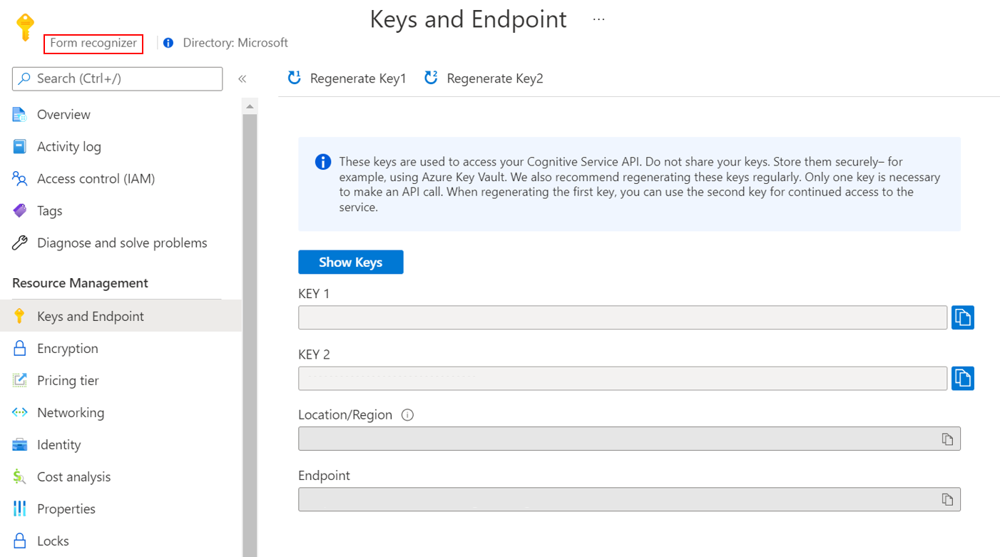
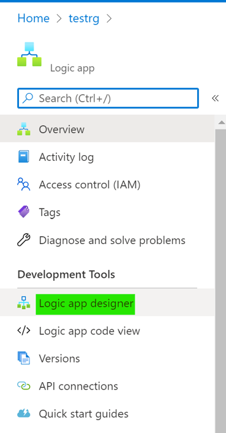
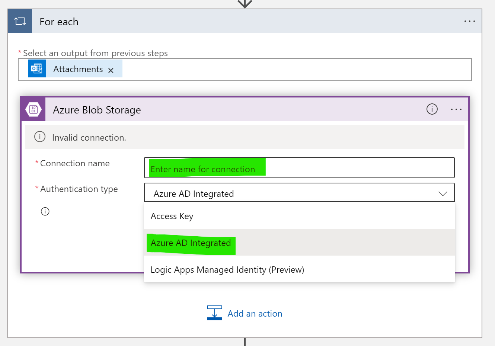

## **Step 7 - Building The Logic Apps**

We need to build two different Logic Apps. 
The first logic app we are going to build will help us ingest the Testing forms and process them.
The second logic app we are going to build will help us ingest the Vaccine cards, process them and verify their vailidity.

### **Deploy the Logic Apps**
The button below will deploy Azure Logic App into the resource group you are using for this solution:

The 2 logic apps will be deployed, one ending in "testform" and the other one ending in "vaccinationcard".

### **Configuring the ARM template**
In order for the logic apps to work, we need to configure the following variables. 

Populate the variables accordingly.

1. **Resource group**: Use the `same resource group` where the previous ARM template was deployed.

2. **Region**: This field will be auto-filled.

3. **Suffix Name**: Insert a `suffix name` (e.g. Your initials)

4. **ADLS Name**: The storage account name you are using for this solution.

5. **Ocp-Apim-Subscription-Key**: The `forms recognizer access key`.
    * Navigagte to the Forms Recognizer resource in your resource group
    * Select `Keys and Endpoint` on the left and copy `Key 1`

6. **Computervision Key**: The `PredictionKey` of the custom vision model.
    * Navigate to the Custom Vision Predictions resource in your resource gorup 
    * Select `Keys and Endpoint` on the left and copy `Key 1`

7. **ComputerVisionPredictions**: The `model name` of the custom vision service.
    * Navigate to the [Azure Custom Vision Portal](customvision.ai)
    * Select `Perfomance` click on `Iteration 1` 
    * Copy the `Publisheed as` value 

8. **Project Id**: The `ProjectID` of the custom vision model.
    * Navigate to the [Azure Custom Vision Portal](customvision.ai)
    * Select the Settings (gear icon) in the top right 
    * Copy the Project Id 

9. **SQLEndpoint**: The `SQL endpoint`
    * Navigate to the Azure Synapse Analytics resource in your resource group
    * Copy the `Dedicated SQL endpoint` value 

10. **FormsContainerSAS**: The SAS token for the `forms` container
For this step, we need to go to the storage account and inside the container generate a SAS
    * Navigate to the  `forms` container in your storage account in your resource group
    * Select the `shared access tokens` on the left
    * Under `permissions` select `Read`, `Access` and `List`
    * Select a reasonable amount of time before it expires. For the above image, we used a year from today (until 2023).

11. **VaccineCardsContainerSAS**: The SAS token for the `vaccinecards` container
    * Follow the previous step 

### **Configuring the Logic App**
Once the Logic Apps are deployed, go to the designer view of either the testform logic app or the vaccination card logic app.

Configure the following 3 connectors:
a. Email connector

b. Storage connector

C. SQL connector

Repeat the same process for the other logic app.

Navigate to Step 8 in the the [Deployment Guide](./Deployment.md)

